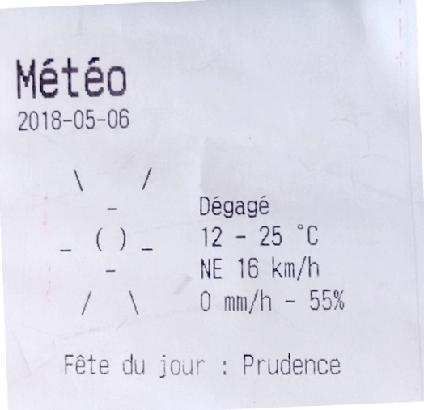

==========
🍳 Recipes
==========

.. module:: thermalprinter.recipes

.. versionadded:: 1.0.0

    Recipes are extras features that you can install on-demand.

.. hint::

    When an executable is made available, you can tweak printer properties using ``TP_*`` environment variables. See :const:`thermalprinter.constants.Defaults`.

------

Calendar
========

.. module:: thermalprinter.recipes.calendar

Print daily stuff from your calendar, and birthdays as a bonus!

.. note::

    🇫🇷 All texts are in French by default.
    You can tweak those constants to better fit your needs:

    .. autodata:: thermalprinter.recipes.calendar.BIRTHDAY
    .. autodata:: thermalprinter.recipes.calendar.MONTH_NAMES
    .. autodata:: thermalprinter.recipes.calendar.NICE_DAY
    .. autodata:: thermalprinter.recipes.calendar.WHOLE_DAY

Installation:

.. code-block:: bash

    sudo apt install libcairo2
    python -m pip install -U 'thermalprinter[calendar]'

There is an executable made available:

.. code-block:: bash

    print-calendar --help

Here is the API:

.. autoclass:: thermalprinter.recipes.calendar.Calendar
.. automethod:: thermalprinter.recipes.calendar.Calendar.start
.. autodata:: thermalprinter.recipes.calendar.TIMEZONE
.. autodata:: thermalprinter.recipes.calendar.BIRTHDAYS_FILE

    .. hint::

        The content of this file is as follow:

        .. code-block::

            YYYY-MM-DD = Alice
            YYYY-MM-DD = Bob

------

.. module:: thermalprinter.recipes.perisan

.. _persian-text:

Persian
=======

Persian text uses non standard codes, and it is quite painful to print it out-of-the-box.

So this extra allowes you to print Persian text as easy as follow (you provide the ``persian`` keyword-argument, and the magic happens under the wood):

.. code-block:: python

    printer.out("...", persian=True)

Installation:

.. code-block:: bash

    python -m pip install -U 'thermalprinter[persian]'

Here is the API:

.. autodata:: thermalprinter.recipes.persian.IRAN_SYSTEM_MAP

    Unicode translations for the Iran code page.

.. note::

    💐 Credits go to `@ghorbanpirizad <https://github.com/ghorbanpirizad>`_ in `issue #4 <https://github.com/BoboTiG/thermalprinter/issues/4>`_.

------

Weather
=======

.. module:: thermalprinter.recipes.weather

How cool is it to have the weather printed every morning, alongside with the saint of the day? 🥰

.. note::

    🇫🇷 All texts are in French by default.
    You can tweak those constants to better fit your needs:

    .. autodata:: thermalprinter.recipes.weather.DESCRIPTIONS

        That is a big one, kept synced with `OWM weather-conditions <https://openweathermap.org/weather-conditions>`_.

    .. autodata:: thermalprinter.recipes.weather.TITLE
    .. autodata:: thermalprinter.recipes.weather.SAINT_OF_THE_DAY
    .. autodata:: thermalprinter.recipes.weather.NORTH
    .. autodata:: thermalprinter.recipes.weather.EAST
    .. autodata:: thermalprinter.recipes.weather.SOUTH
    .. autodata:: thermalprinter.recipes.weather.WEST

Installation:

.. code-block:: bash

    python -m pip install -U 'thermalprinter[weather]'

There is an executable made available:

.. code-block:: bash

    print-weather --help

Here is the API:

.. autoclass:: thermalprinter.recipes.weather.Weather
.. automethod:: thermalprinter.recipes.weather.Weather.start
.. autofunction:: thermalprinter.recipes.weather.mps_to_kmph
.. autofunction:: thermalprinter.recipes.weather.wind_dir
.. autodata:: thermalprinter.recipes.weather.ASCII_ARTS

    Beautiful weather ASCII arts, copied from `schachmat/wego <https://github.com/schachmat/wego/blob/2.3/frontends/ascii-art-table.go>`_.

.. autodata:: thermalprinter.recipes.weather.SAINTS_FILE
.. autodata:: thermalprinter.recipes.weather.URL
.. autodata:: thermalprinter.recipes.weather.TIMEZONE
